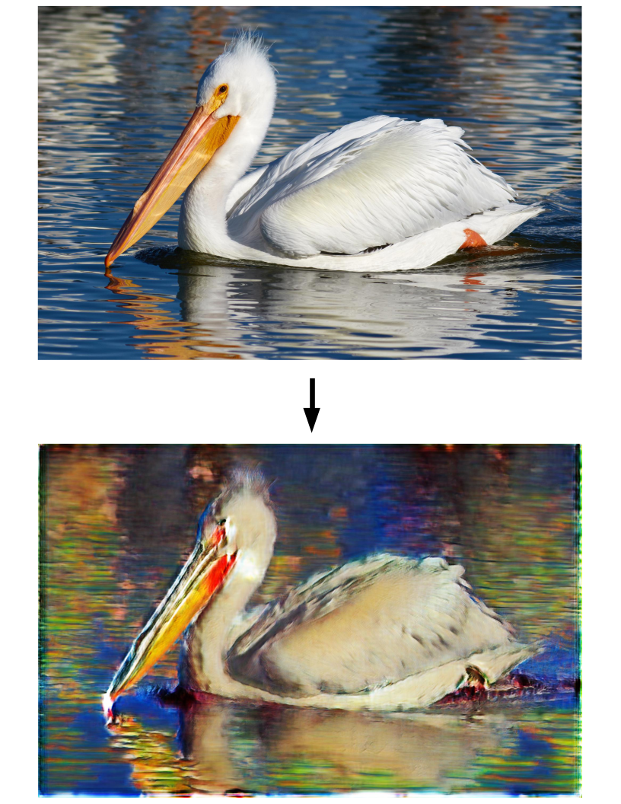

# A Siamese Architecture for Neural Style Transfer
The implementation of the siamese architecture that I developed for my [master's thesis](https://matthias-wright.github.io/files/ma_thesis.pdf).

## Dependencies
* Python 3.5.2+
* NumPy 1.11.0+
* PyTorch 0.4.1+
* PIL 1.1.7+
* Matplotlib 3.0.1+

## Example

<p align="center">
  
</p>

## Instructions

### Training

```python
import siamese

data_photo = '...' # file path to the photograph images (RGB) folder
data_oil = '...' # file path to the oil images (RGB) folder
siam_model = siamese.Siamese(in_path_photo=data_photo,
                             in_path_oil=data_oil, 
                             autoencoder_path='saves/autoencoders', 
                             num_epochs=100, batch_size=50,
                             learning_rate=0.0002, 
                             recon_loss_weight=10, 
                             penalty_coef=10, verbose=True)
                          
siam_model.train()
```

### Load Pretrained Model

```python
import siamese

data_photo = '...' # file path to the photograph images (RGB) folder
data_oil = '...' # file path to the oil images (RGB) folder
siam_model = siamese.Siamese(in_path_photo=data_photo,
                             in_path_oil=data_oil, 
                             autoencoder_path='saves/autoencoders', 
                             num_epochs=100, batch_size=50,
                             learning_rate=0.0002, 
                             recon_loss_weight=10, 
                             penalty_coef=10, verbose=True)

siam_model.load(epoch=18, path='saves')                                 
```

### Style Transfer

```python
import siamese
import util

siam_model = siamese.Siamese(autoencoder_path='saves/autoencoders')
siam_model.load(epoch=18, path='saves')     

x_photo = util.image_to_tensor('image.jpg')
x_oil = siam_model.translate_photo_to_oil(x_photo)
x_oil = util.tensor_to_numpy(x_oil)
x_oil = util.numpy_to_image(x_oil)
x_oil.save('stylized_image.png')                                    
```

## License
This project is licensed under the [MIT Licence](https://choosealicense.com/licenses/mit/)
